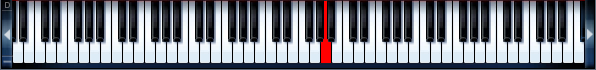

## Musical Key Frequency Basic Demonstration

The following is a brief visual demonstration of the mathematical frequencies of keys on a piano.  

--- .class #id 

## Background

In most western cultures, pianos are tuned by dividing octaved into <a href="https://en.wikipedia.org/wiki/Equal_temperament#Twelve-tone_equal_temperament">twelve</a> equal <a href="https://en.wikipedia.org/wiki/Semitone">semitones</a>.
  

Traditionally, the 5th A key is tuned to 440Hz (cycles per second): 

This key has a scientific name of <b>A4</b> (as the first A is named A0).

## Formula

A4 is the 49th key on the piano and is traditionally used as a baseline for determining the frequency of any key, using the following formula: 

--- .class #id

## Usage

This simple educational application has just one input - a radio button list in the sidebar.  Selecting a note will cause the following to occur: 

1. Update the image output showing which key on the piano is represented
2. Update the text output to display the value of the frequency in <a href="https://en.wikipedia.org/wiki/Hertz">Hertz</a> of the selected note
3. Update the plot output to display the corresponding sine wave

--- .class #id 

## Future State

This tool can be extended in the future to accommodate the following: 

1. Play tones matching the selected frequency
2. Use javascript to replace the existing radio buttons with a custom a piano image input object
3. Allow the user to select multiple notes, and demonstrate the interval-relationships between the selected notes
